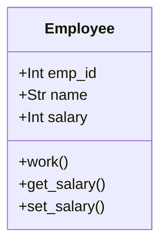

# クラス図概念

- UML class diagram　IBM Develpers 

https://developer.ibm.com/articles/the-class-diagram/

# クラス図

```mermaid

classDiagram
    class Employee
    Employee : +Int emp_id
    Employee : +Str name
    Employee : +Int salary
    Employee : +work()
    Employee : +get_salary()
    Employee : +set_salary()
```