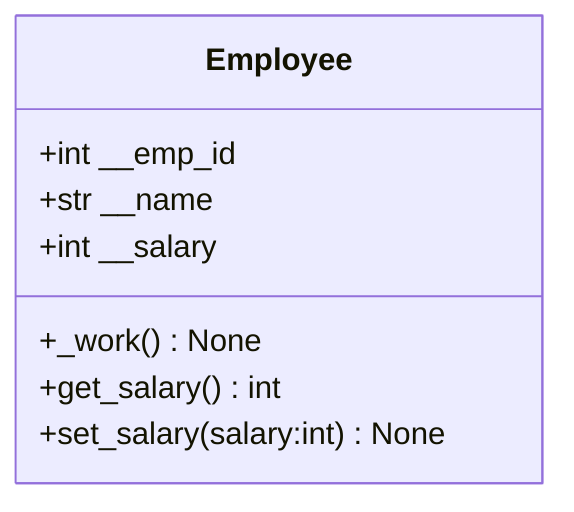
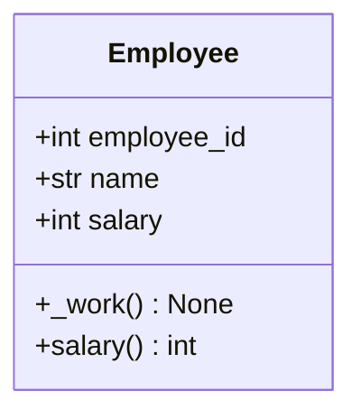
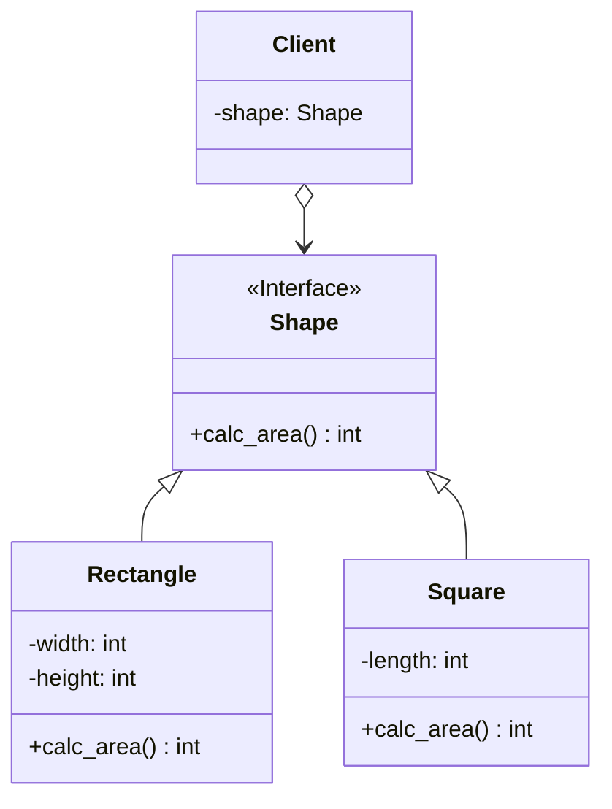

# クラス図概念

https://developer.ibm.com/articles/the-class-diagram/

https://tmytokai.github.io/open-ed/activity/class-diag/

# クラス図

### practice1
メソッドを利用してクラスを定義した場合

### practice2
デコレーターを利用してクラスを定義した場合

### practice3
