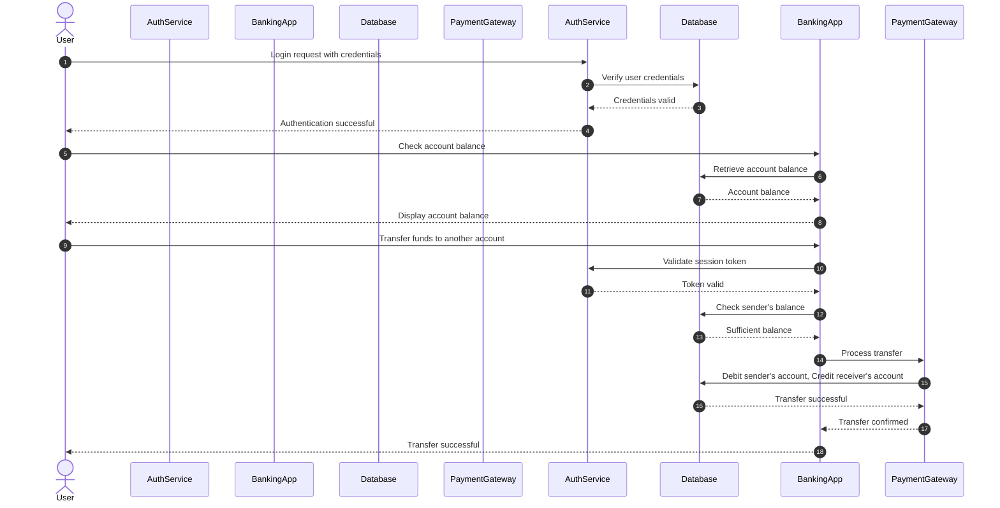

# sample study

### Explanation of Additional Features
- **`autonumber`**: Adds step numbering to each message for easier tracking.
- **Custom Labels and Colors**:
    - You can use aliases (e.g., `"AuthService" as AuthService`) to give participants custom names or abbreviations.
    - Mermaid currently doesn't allow direct color customization for sequence diagrams, but you can add colored notes or labels around interactions using `note` for emphasis, although not specific to each message color.

### Detailed Steps in the Diagram
1. **Login Flow**:
   - The `User` initiates a login with `AuthService`, which verifies credentials with the `Database`.
   
2. **Balance Check**:
   - Once authenticated, the `User` requests their balance through `BankingApp`, which retrieves it from the `Database`.

3. **Funds Transfer**:
   - The `User` initiates a funds transfer. `BankingApp` validates the session token with `AuthService`, confirms the sender's balance in `Database`, and then processes the transaction with `PaymentGateway`.
   - `PaymentGateway` debits and credits accounts as needed, confirming the transfer.
