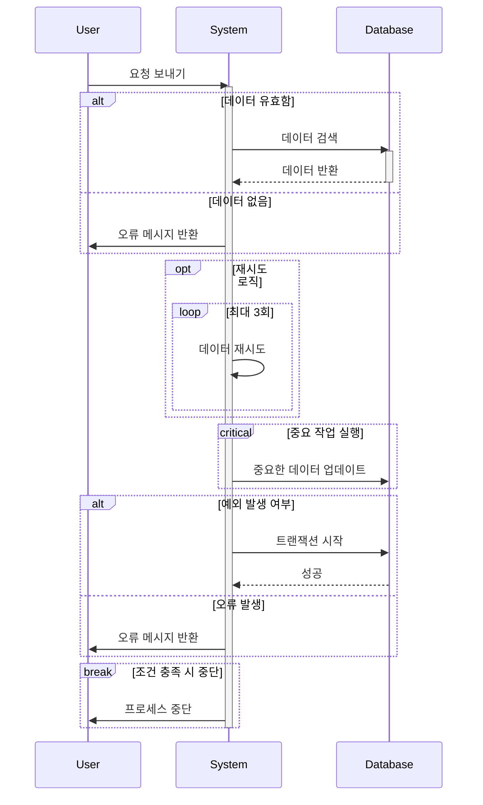

* alt (조건 분기): if-else 문과 비슷한 구조.
* opt (옵션 블록): 실행할 수도 있고 안 할 수도 있는 블록.
* loop (반복문): 특정 횟수만큼 반복 실행.
* critical (중요 블록): 반드시 실행되어야 하는 중요 작업.
* try-catch: 예외 처리 패턴.
* break: 특정 조건에서 중단하는 흐름.
* activation/deactivation: 활성화 및 비활성화 표현.